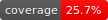

# csv2svg




This command generates svg table from csv format.

The reason why I make this command is below.

* The table may be cut by pdf format.
* Many web sites don't accept html format as attach files.
* Png format files don't include copyable texts.

## how to install
```
go get -u github.com/umaumax/csv2svg/...
```

## how to use
```
csv2svg data/sample.csv
# output is data/sample.svg

cat data/sample.csv | csv2svg
# output is /dev/stdout
```

## TODO
* Write test code!
* accept markdown table format file
* output file flag
* table title by flag or file name?

## NOTE
* Don't surround words by `"` in csv files.? (maybe fixed by lazy option in code)

## FYI
* [ajstarks/svgo: Go Language Library for SVG generation]( https://github.com/ajstarks/svgo )

## FMI
run below code before push
```
./pre_push_hook.sh
```
